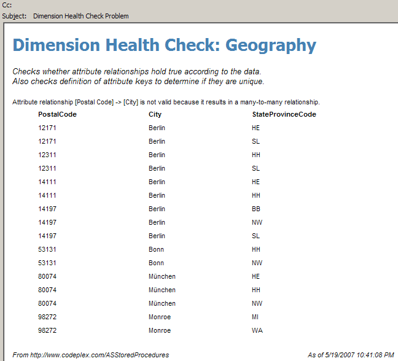

This feature allows you check various indications of dimension health. Currently, this feature:

* Checks that attribute relationships hold true according to the data. For instance, if a Subcategory is actually a part of more than one Category, that attribute relationship should not be used. Usually, fixing this problem involves revisiting the definition of the keys for each attribute.
* Checks the definition of attribute key to determine uniqueness. Particularly, this check determines if a particular key has more than one name.

A Reporting Services report is included in the source code which allows you to view the results of a dimension health check in a friendly format. Also, a file called DimensionHealthCheckSubscription.rss in the source code allows you to create a data-driven subscription which automatically runs a dimension health check on every dimension in your database daily and emails you if there are any problems. That email looks like the following:

**Notes**

* The ASSP assembly must be registered with unrestricted permissions for the SnapshotMemoryUsageTotals function to succeed. It also must be registered with Impersonation user which can connect to the SQL datasource your dimensions are being built off of. (SQL Security is not supported, only Integrated Security.)
* After deploying the report, if you wish to create a data-driven subscription you must first edit the "Dimension Health Check SSAS" datasource and store the credentials. Then follow the instructions in the top of the DimensionHealthCheckSubscription.rss script.
* Data-driven subscriptions are only supported in Enterprise or Developer edition.
* Due to a [bug](https://connect.microsoft.com/SQLServer/feedback/ViewFeedback.aspx?FeedbackID=277799) you cannot use the UI to edit the data-driven subscription. Instead, edit the DimensionHealthCheckSubscription.rss script. Or you can create a new datasource which uses the OleDb provider for Analysis Services instead of the richer Analysis Services provider.
* This feature uses the same codebase as the [Dimension Health Check](https://bideveloperextensions.github.io/features/DimensionHealthCheck) feature of [BI Developer Extensions](https://bideveloperextensions.github.io) except that it only supports SQL Server as a datasource. (BI Developer Extensions supports Oracle as a datasource.) The BI Developer Extensions version of this code is designed to help you validate dimension data during development. The ASSP version of this code is designed to alert you when bad dimension data appears on a production server.
* One user has reported that this feature crashed the Analysis Services process due to a bug in the .NET Framework, so use this feature on a production server with care.