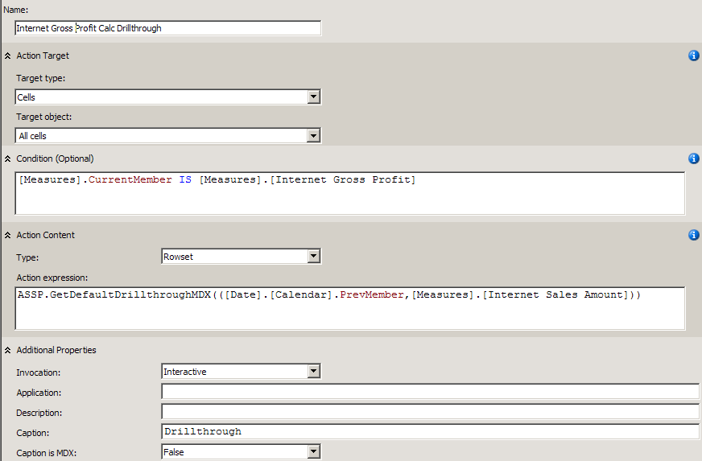
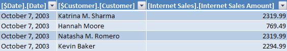
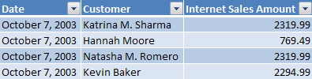

This set of functions helps with various forms of custom drillthrough. They are an extension of Mosha's idea about [drillthrough on calculated measures](http://sqlblog.com/blogs/mosha/archive/2008/09/01/drillthrough-on-calculated-measures.aspx).

> Note: The following functions do not take into account multi-select filters in Excel 2007 due to limitations in MDX's ability to detect multi-selects (and because Excel 2007 doesn't even ask what actions are available on cells any time there is a multi-select on the PivotTable filters.)

>Note: The following functions do not behave well in situations where there is a DefaultMember which is not the All member due to a [bug](http://connect.microsoft.com/SQLServer/feedback/ViewFeedback.aspx?FeedbackID=376203) in Excel 2007._

>Note: You can only use the following functions to create rowset actions, and rowset actions cannot be the default action. So you will never be able to double click a cell and have it use the following tools to run a drillthrough. These rowset actions are only launched from the client tool in the Actions menu._

**GetDefaultDrillthroughMDX(_tuple, MaxRows, skipDefaultMembers_)**
This function returns a valid drillthrough MDX statement which takes into account the CurrentMember on all hierarchies. The drillthrough query does not specify the RETURN clause, therefore the columns returned are simply the default drillthrough columns (defined by your default drillthrough action, or defined by the system. Passing in the first parameter can override the CurrentMember of any hierarchies you include in the tuple. Passing in an integer as the second parameter specifies the maxrows the drillthrough query can return. (If you don't specify that parameter, it returns up to the the number defined by the DefaultDrillthroughMaxRows server setting.)

**GetCustomDrillthroughMDX(ReturnColumns, _tuple, MaxRows, skipDefaultMembers_)**
This function returns a valid drillthrough MDX statement which takes into account the CurrentMember on all hierarchies. The drillthrough query specifies the [RETURN](http://technet.microsoft.com/en-us/library/ms145964.aspx) clause so that just the columns you request are returned. A string containing the return columns is specified as the first parameter. Passing in the second parameter can override the CurrentMember of any hierarchies you include in the tuple. Passing in an integer as the third parameter specifies the maxrows the drillthrough query can return. (If you don't specify that parameter, it returns up to the the number defined by the DefaultDrillthroughMaxRows server setting.)

Any of the following expressions can be used as the "Action expression" property of a Rowset action:

```
ASSP.GetDefaultDrillthroughMDX([Measures].[Internet Sales Amount]) 
ASSP.GetDefaultDrillthroughMDX(([Date].[Calendar].PrevMember,[Measures].[Internet Sales Amount])

ASSP.GetDefaultDrillthroughMDX(([Date].[Calendar].PrevMember,[Measures].[Internet Sales Amount] ,1000)

ASSP.GetCustomDrillthroughMDX(
    "[Internet Sales].[Internet Sales Amount]
    ,[Internet Sales].[Internet Total Product Cost]
    ,NAME([$Date].[Date])
    ,NAME([$Customer].[Customer])
    ,NAME([$Product].[Product])
    ,NAME([$Promotion].[Promotion])
    ,NAME([$Source Currency].[Source Currency Code])"
   )

ASSP.GetCustomDrillthroughMDX(
    "[Internet Sales].[Internet Sales Amount] as [SalesAmt]
    ,[Internet Sales].[Internet Total Product Cost] as [ProdCost]
    ,NAME([$Date].[Date]) as [Date]
    ,NAME([$Customer].[Customer]) as [Cust]
    ,NAME([$Product].[Product]) as [Prod]
    ,NAME([$Promotion].[Promotion]) as [Promotion]
    ,NAME([$Source Currency].[Source Currency Code]) as [Curr]"
   )

ASSP.GetCustomDrillthroughMDX(
    "[Internet Sales].[Internet Sales Amount]
    ,[Internet Sales].[Internet Total Product Cost]
    ,NAME([$Date].[Date])
    ,NAME([$Customer].[Customer])
    ,NAME([$Product].[Product])
    ,NAME([$Promotion].[Promotion])
    ,NAME([$Source Currency].[Source Currency Code])"
   ,([Date].[Calendar].PrevMember)
   ,1000
   )
```

The function calls above which specify the ```[Date].[Calendar].PrevMember``` are useful in cases where you want to do drillthrough on a calculated measure which shows the prior period. This function call will cause the drillthrough to show the detail rows for the prior calendar period, not the current calendar period.


Take a simple calculation:
```
create member CurrentCube.[Measures].[Black Products Sales Amount]
as ([Measures].[Internet Sales Amount], [Product].[Color].&[Black]);
```

If the calculation is just a tuple (no IIF expressions or ratios or scope statements) then the following dynamic action expression can be used to retrieve the MDX expression and then create an appropriate drillthrough command with that filter context in mind:

```
ASSP.GetDefaultDrillthroughMDX(
  StrToTuple(
    ASSP.DiscoverSingleValue(
     "EXPRESSION"
     , "MDSCHEMA_MEASURES"
     , "<MEASURE_NAME>" + [Measures].CurrentMember.Name + "</MEASURE_NAME>"
       + "<CUBE_NAME>" + [Measures].CurrentMember.Properties("CUBE_NAME")
       + "</CUBE_NAME>"
    )
    ,CONSTRAINED
  )
)
```

To setup a rowset actions to use the above custom drillthrough commands, create an action like the following:
1. Define new action. Note, that it cannot be “Drillthrough action”, since it won’t even apply to calculated measures. Just a regular action.
1. Set the “Action Target” property to “Cells”
1. In the “Condition” property use an expression to limit which measures this custom drillthrough applies to. An example would be ```[Measures].CurrentMember IS [Measures].[Internet Gross Profit[```. See below to the ```GetMeasureGroupCalculatedMeasures``` function for another example of a Condition expression.
1. “Action Type” needs to be set to “Rowset”
1. Set the “Caption” to “Drillthrough”, so in UI of the client tool it will show up with this title, and it will be obvious to the user.
1. Use one of the ASSP function calls from above as the expression. The expression should return a string. (The client tool executes the drillthrough command string it is given.)

When you are done, your action should look something like:




**ExecuteDrillthroughAndFixColumns(DrillthroughMDX)**
A common complaint about drillthrough is that the column names are annoying and confusing for business users:



The **ExecuteDrillthroughAndFixColumns** function is designed to help fix the column names in drillthrough:



The DrillthroughFixedColumnNames function takes in a string containing the drillthrough MDX. It opens a connection, runs the drillthrough MDX, fixes the column names, then returns a DataTable containing the drillthrough rowset with fixed column names.

You can wrap any GetDefaultDrillthroughMDX or GetCustomDrillthroughMDX command above and use as the Action expression of a rowset action with syntax like:

```
'call ASSP.ExecuteDrillthroughAndFixColumns("' 
 + ASSP.GetDefaultDrillthroughMDX(([Date].[Calendar].PrevMember)) 
+ '")'
```
_Note: Be very careful of the single and double quotes._
_Note: The restrictions about multi-select and DefaultMembers listed at the top apply. Be careful when using these functions._


**GetMeasureGroupCalculatedMeasures(MeasureGroupName)**
This is a helper function which can be useful in the condition of an action to avoid hardcoding the list of calculated measures in a measure group. Similar to the built-in MeasureGroupMeasures function which returns a set of the measures in a measure group, The GetMeasureGroupCalculatedMeasures function returns a set of the calculated measures in a measure group. You could use the following expression as the Condition for your rowset action if you wanted it to apply to all calculated measures in a measure group:

```raw
Except([Measures].CurrentMember,ASSP.GetMeasureGroupCalculatedMeasures("Internet Sales")).Count = 0
```

_Note: Do not use this function in the MDX script as it will be returning a set from the previously processed version of the cube. This could be a problem if the cube changed or if the cube was previously unprocessed._


**CurrentCellAttributes(_tuple_)**
This is a helper function if you want to build your own drillthrough query yourself, for some reason. It will probably not be used often given the GetDefaultDrillthroughMDX and GetCustomDrillthroughMDX functions mentioned above which use it behind the scenes. This function, if no parameter is specified, returns a string of the CurrentMember of each attribute in the cube. It does not specify the current measure if it is a calculated measure. Passing in a tuple as a parameter overwrites the current context with that tuple, thus impacting the string that is returned from this function.

CurrentCellAttributes can be useful in constructing a rowset action which builds a MDX query that detects the current context. For example, to return the distinct employees in the current context, use a rowset action whose action expression is a string constructed with the following expression:

```raw
"select {
  [Measures].CurrentMember} on 0, 
  NON EMPTY [Employee].[Employee].[Employee].Members on 1 
  from 
    (select (" + 
      ASSP.CurrentCellAttributes([Measures].CurrentMember) 
      + ") on 0 
      from [CubeName](CubeName))"
```