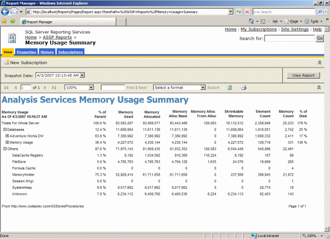
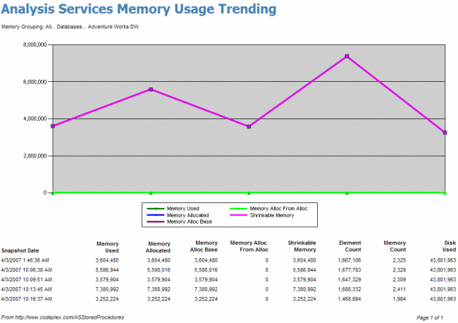
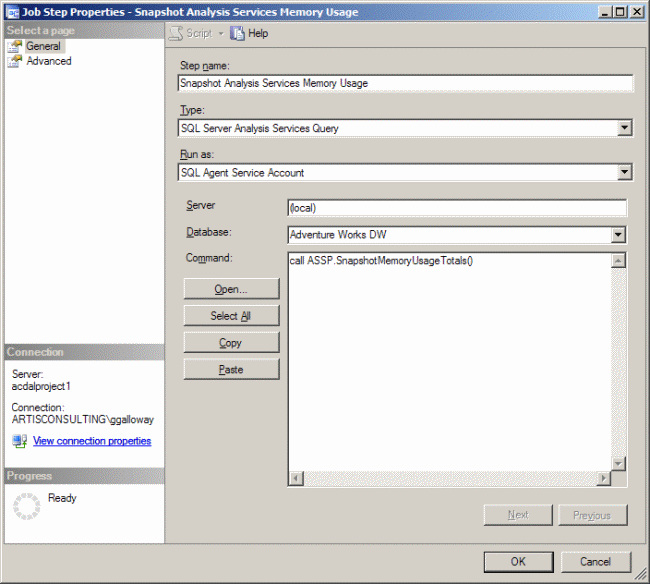
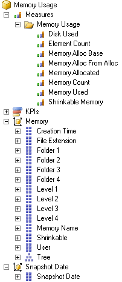

_AS2008 and later: This stored procedure does not currently function well in AS2008 or above. We recommend you use the [ResMon](http://sqlsrvanalysissrvcs.codeplex.com/wikipage?title=ResMon%20Cube%20Documentation) cube as an alternative as it is much more elegant of an approach._

**Overview**

The SnapshotMemoryUsageTotals function allows an administrator to snapshot Analysis Services' memory and disk usage at a point in time for further analysis. Two reports are distributed with the [source code](https://github.com/ASStoredProcedures/ASStoredProcedures). The first report allows you to analyze the breakdown of memory and disk usage from a particular snapshot:



Then you can click on a particular node (such as the Adventure Works DW database) and drill into a trending report for that particular selection:




**Usage**

Before you can view data in the reports, you must deploy the ASSP assembly (with unrestricted permissions) and run the following MDX statement:

```raw
call ASSP.SnapshotMemoryUsageTotals()
```
We suggest you consider creating a SQL Agent job to run that statement periodically. Having periodic snapshots of memory and disk usage will allow for more useful trending and profiling over time. The SQL Agent job would be set up as follows:




**How it Works**

The SnapshotMemoryUsageTotals function builds a new Analysis Services database called Memory Usage and populates it with data derived mostly from the {"DISCOVER_MEMORYUSAGE"} XMLA command. This command returns a huge XML response with 25,000 or more rows describing each sector of memory inside the msmdsrv.exe process. The rows it returns look something like:

```xml
<row>
  <MemoryID>292347920</MemoryID> 
  <MemoryName>FileStore: \\?\C:\Program Files\Microsoft SQL Server
    \MSSQL.2\OLAP\Data\Adventure Works.32.db\Dim Reseller.0.dim
    \10.Reseller Name.(All).ostore,</MemoryName> 
  <SPID>0</SPID> 
  <CreationTime>2007-03-11T02:44:08</CreationTime> 
  <BaseObjectType>2036625218</BaseObjectType> 
  <MemoryUsed>8192</MemoryUsed> 
  <MemoryAllocated>8192</MemoryAllocated> 
  <MemoryAllocBase>8192</MemoryAllocBase> 
  <MemoryAllocFromAlloc>0</MemoryAllocFromAlloc> 
  <ElementCount>1</ElementCount> 
  <Shrinkable>true</Shrinkable>
</row>
```

The raw ```"DISCOVER_MEMORYUSAGE"``` results are not very easy to analyze because there is so much detail. After the ASSP SnapshotMemoryUsageTotals function has put this data into a cube, the data is much easier to slice and dice.

The results of ```"DISCOVER_MEMORYUSAGE"``` cannot be easily tied to their associated Analysis Services object. The SnapshotMemoryUsageTotals function does this for you allowing you to profile memory usage by database, dimension, cube, measure group, and partition.

Most cubes are built on top of relational data warehouse tables, and when the cube is processed, Analysis Services pulls the data into the cube. Analysis Services also supports push-mode processing. The SnapshotMemoryUsageTotals function utilizes this feature to take the ```"DISCOVER_MEMORYUSAGE"``` results and pump them into the Memory Usage cube.

The end result is a cube which can be browsed:


The ```"DISCOVER_MEMORYUSAGE"``` command is not documented well so the exact definitions for each data element are not known at this time. The following documentation mostly describes the transformations done to the raw ```"DISCOVER_MEMORYUSAGE"``` data:

* _Memory Used_ - expressed in bytes
* _Memory Allocated_ - expressed in bytes
* _Memory Alloc Base_ - expressed in bytes
* _Memory Alloc From Alloc_ - expressed in bytes
* _Element Count_ - unknown
* _Memory Count_ - the count of rows from the ```"DISCOVER_MEMORYUSAGE"``` command
* _Shrinkable Memory_ - Is a sum of the Memory Allocated measure where that memory is shrinkable.
* _Disk Used_ - Calculated by SnapshotMemoryUsageTotals by scanning the file sizes on disk for all Analysis Services objects. Expressed in bytes.
* _% of Disk_ - Seen in the Memory Usage Summary report. Is defined as Memory Allocated divided by Disk Used. Note that is is possible for percent to be larger than 100% if, for example, a file on disk is 1KB but it is stored in memory in an 8KB chunk. Therefore, _% of Disk_ is not an exact indication of the percentage of files that are pinned in memory.
* _User_ - The ```"DISCOVER_MEMORYUSAGE"``` command returns a SPID which the SnapshotMemoryUsageTotals ties to a username if possible.
* _Tree_ - This hierarchy defines the organization of Analysis Services objects. The individual rows from the ```"DISCOVER_MEMORYUSAGE"``` command are tied to the appropriate place in the tree when possible.
* _Memory Name_ - Avoid using this attribute as it can have 20,000 members or more. If you need to use this attribute during ad-hoc slicing and dicing, be sure to filter by some node in the Tree hierarchy first.


**Notes**

* The ASSP assembly must be registered with unrestricted permissions for the SnapshotMemoryUsageTotals function to succeed.
* Depending upon the memory and disk footprint of your Analysis Services instance, each snapshot could consume 1MB to 5MB (or even more on large 64-bit servers), and it could take 5 minutes or more to complete taking each snapshot.
* Monitor usage of the SnapshotMemoryUsageTotals especially under low memory situations as it is very memory intensive.
* The reports run very slowly under SP1, but very quickly under SP2.

